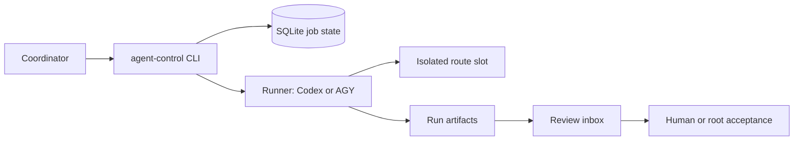

# Agent Control Plane

Agent Control Plane (ACP) is a local control plane for bounded coding jobs. It assigns
agents to isolated slots, records prompts and results, supervises terminal completion,
and leaves the final review and merge decision with a human or coordinating agent.

## Why ACP exists

Launching several agent processes is not coordination: work can collide in one checkout,
disappear into a terminal, or be reported successful while still running. ACP adds
durable job state, route and branch checks, exclusive slots, dependency-aware plans,
bounded logs, review-inbox handoffs, and verification evidence. It coordinates agents;
it does not decide whether their patches should be accepted.

ACP is useful for repeatable, auditable delegation across repositories or parallel tasks.
It is overkill for one short prompt in one clean checkout, and it is not a hosted queue,
cloud scheduler, or unattended merge service.

## Architecture



## Requirements

- Python 3.11 or newer and Git on `PATH`.
- Codex CLI or Google Antigravity CLI (`agy`) only for the backend you choose.
- No agent CLI, IDEA, or network access is needed for the offline demo below.

## Install

From a clone, install the command with `pipx` or `uv`:

```powershell
pipx install .
uv tool install .
```

For editable development work:

```powershell
python -m venv .venv
.\.venv\Scripts\Activate.ps1
python -m pip install -e ".[dev,mcp]"
```

## Five-minute offline demo

The demo uses local fixtures and does not call an agent, IDEA, or the network. Run it,
inspect the recorded result, then cross the explicit acceptance boundary:

```powershell
agent-control demo run --output ../agent-control-demo
agent-control demo show ../agent-control-demo
agent-control demo accept ../agent-control-demo
```

The output directory is disposable. Acceptance is neither an automatic merge nor a push.

## Production quickstart

Create a private config, define a route and slots, validate it, then supervise a job:

```powershell
Copy-Item .\config\workspaces.example.toml .\config\workspaces.toml
agent-control smoke --config .\config\workspaces.toml
agent-control slots sync --config .\config\workspaces.toml
agent-control start --config .\config\workspaces.toml `
  --task-id review-auth-flow --route app --slot app-1 `
  --expected-branch codex/review-auth-flow --wait --live
```

Use `--workspace-access native` for Codex-native tools, or the IDE-backed mode when IDEA
diagnostics are part of the route. Supervise with `--wait`, `watch`, or a heartbeat:
`queued` and `running` are never completion.

## Safety and review boundary

ACP refuses dirty workspaces by default, keeps slot assignment exclusive, and records
durable prompts, logs, process identity, results, and verification. Dangerous bypass is
opt-in. Checkpoint cleanup waits for durable controller evidence; ACP does not push, merge,
or accept a patch. Review the diff and verification before recording acceptance.

## Further reading

- [Operations](docs/operations.md)
- [Recovery matrix](docs/recovery-matrix.md)
- [Compatibility](docs/compatibility.md)
- [Upgrading](docs/upgrading.md)
- [Changelog](CHANGELOG.md)
- [Releasing](docs/releasing.md)

See the tracked configuration example for route, slot, runner, and quality-gate options.

## Configure

Copy the ignored local config and edit it for your machine:

```powershell
Copy-Item .\config\workspaces.example.toml .\config\workspaces.toml
```

The local file is ignored: keep machine-specific paths and defaults there, outside
versioned public content. Relative paths resolve from this repository root. A minimal
route and slot configuration is:

```toml
[control]
coordination_root = ".agent-work"
runs_root = "runs"
database = "runs/jobs.sqlite3"
worktree_root = "../acp-worktrees"
slot_root = "../acp-slots"

[routes.app]
path = "../my-project"
required_branch = "main"

[slots."app-1"]
route = "app"
path = "../acp-slots/app-1"
```

Validate the config, then synchronize declared slots:

```powershell
agent-control smoke --config .\config\workspaces.toml
agent-control slots sync --config .\config\workspaces.toml
```

For operational procedures and recovery behavior, see [Operations](docs/operations.md)
and the [Recovery matrix](docs/recovery-matrix.md).

## Core Concepts

A route names a repository target, including its canonical path and required branch. A
slot is an isolated worktree assigned to that route; agents edit there while the canonical
checkout remains untouched. Keep slot directories outside this repository.

A job is one delegated task with durable prompt, log, result, and SQLite records. A plan
groups logical tasks into a dependency graph so ready work can be dispatched and retried.
The review inbox is the handoff point for results and verification; delivery is not
acceptance.

The backend selects the runner (`codex` or `agy`). Workspace access is separate: `ide_mcp`
uses the configured IDE integration, while `native` uses Codex-native shell and file tools
in the assigned workspace. Set it globally, per route, or per job; the most specific
setting wins. Native mode is Codex-only and does not provide IDEA diagnostics/refactors.

For operational procedures and failure handling, see [Operations](docs/operations.md) and
the [Recovery matrix](docs/recovery-matrix.md). Quality gates run only when configured;
their evidence must be present in `verification.json` before a result can be review-ready.

The checkpoint is the boundary between worker output and root review. ACP verifies the
checkpoint and review-inbox record, but never pushes, merges, or accepts a patch. The root
reviewer inspects the diff and verification before acceptance.

## Plan Supervisor Workflow

A durable plan is the coordination boundary: it stores tasks, dependencies, execution routes,
attempts, and bounded state projections in SQLite. Dispatch claims ready tasks atomically;
dependent tasks stay locked until the root records acceptance. Use the foreground supervisor
for crash-resumable execution:

```powershell
agent-control plan create --manifest .\transfer-plan.json --config .\config\workspaces.toml
agent-control plan run transfer --until-review --max-jobs 2 --config .\config\workspaces.toml
agent-control plan summary transfer --config .\config\workspaces.toml
agent-control plan watch transfer --since <cursor> --timeout-sec 25 --config .\config\workspaces.toml
```

`plan run --until-review` stops at review boundaries, failures, cancellation, or missing
execution specs. It never accepts, rejects, retries, pushes, or merges work. Retry and
acceptance are explicit root decisions; review the diff, checkpoint, result, and verification
before unlocking dependants. Use bounded cursors and excerpts from plan summaries and watches;
full logs remain in the run artifacts.

## Safety Boundaries

ACP refuses dirty workspaces by default and keeps slot ownership exclusive. Native routes use
Codex-native tools in the declared workspace; IDE-backed routes remain isolated per slot.
Dangerous bypass is opt-in. Recovery is fail-closed: stale or unverifiable process identity,
late edits, missing evidence, and mismatched checkpoint refs leave work quarantined. ACP never
pushes, merges, or treats worker delivery as acceptance. Keep private configs, prompts, logs,
SQLite state, and generated worktrees outside versioned public content.

## Current Alpha Status

ACP is an alpha local-automation tool. The offline demo is the safest first check; production
use should begin with read-only jobs, explicit branch and slot validation, supervised completion,
and root review. Treat `queued` and `running` as in-progress states, not success. Before
upgrading or releasing, consult [Operations](docs/operations.md), [Recovery matrix](docs/recovery-matrix.md),
[Compatibility](docs/compatibility.md), [Upgrading](docs/upgrading.md), and
[Releasing](docs/releasing.md). Review release history in [CHANGELOG.md](CHANGELOG.md).
